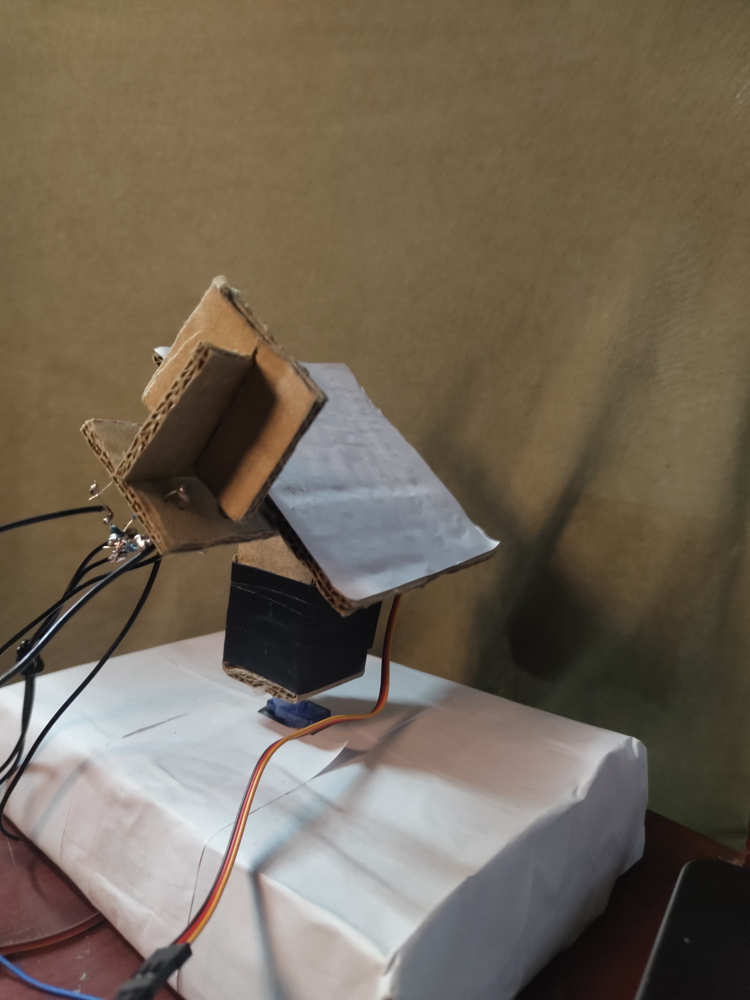

# 🌞 DAST - Dual Axis Solar Tracker

An Arduino-based project designed to automatically orient a solar panel towards the sun so as the maximize the energy output.

---

## 🛠️ Hardware Components

- Arduino UNO
- 4x LDR (Light Dependent Resistor)
- 2x Servo motors (SG90)
- Resistors (10kΩ)
- Breadboard and jumper wires
- Solar Panel Model and Mounting Frame (Cardboard)

---

## 👨🏽‍💻 Software & Libraries

- Arduino IDE
- `Servo.h` library

---

## 📐 Circuit Diagram

